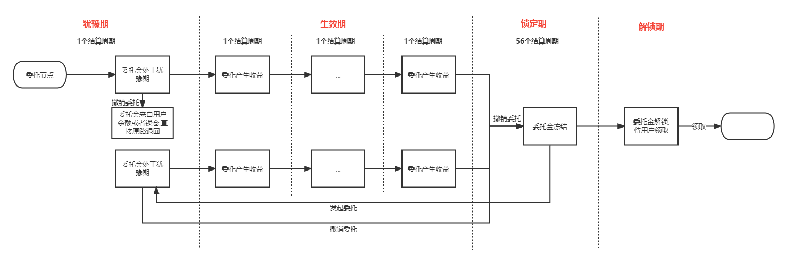

# AIP-18：关于支持委托锁定的提案

## 背景
Alaya网络上目前ATP持有者委托验证人节点是很灵活的，可以随时取消委托换其他人， 除了解委托的结算周期内（约3个小时）获取不到委托收益外不会有其他的损失， 这样会存在以下问题：

1. 公平性问题
对于节点来说，解除质押有锁定期，锁定期内限制流通，而委托没有限制的话对于质押节点来说是不太公平的，这样会影响质押节点的积极性，节点不愿意通过增加质押来获得收益而更愿意用来委托

2. 流通导致的安全问题
我们都知道对于PoS机制的公链来说Staking比例越高网络越安全，如果参与维护网络稳定的验证人节点都不愿意Staking，而把大部分Token用来委托，这样就极大增加了Token流通，给网络带来潜在的危险，举个简单的例子，恶意节点可以通过大量获得流动的Token，质押多个节点（超过2/3）来达到控制网络的目的

## 目的
限制用户随意解委托,撤销委托后委托金需要被锁定一段时间不能被任意使用。

## 内容

### 委托锁定流程
在现有委托的基础上增加锁定功能，流程如下：

支持锁定功能的委托有四个生命周期：

- 犹豫期

  用户发起委托时的结算周期为犹豫期，处于犹豫期的委托可以发起撤销委托操作，委托金会即时退回给委托人。

- 生效期

  犹豫期过后的结算周期为生效期，该周期内委托正式生效，可领取委托奖励。用户如在生效期间发起撤销委托操作,当前结算周期委托收益保留,在下一个结算周期进入锁定期。

- 锁定期

  委托金在撤销后需要被锁定若干个结算周期，从用户发起撤销委托操作后的下个结算周期开始计算。委托金被锁定后无法产生收益,该金额可以被用来对任意节点发起锁定委托,下个结算周期生效。若在委托生效前撤销委托，在当前结算周期基础上锁定56个结算周期。

- 解锁期

  锁定期过后的委托金需要用户主动领取，此期间为解锁期。

### 委托锁定周期

增加可治理参数,委托锁定周期,默认为56个结算周期.

